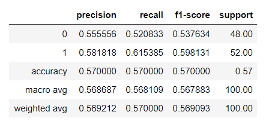

# Binary Classification Project Using Decision Tree With Kaggle Dataset
I will be going over the workflow I used to determine if we can predict whether a person is male or female based on different variables using the decision tree algorithm.

# Decision Tree
> A decision tree is a decision support tool that uses a tree-like model of decisions and their possible consequences, including chance event outcomes, resource costs, and utility. It is one way to display an algorithm that only contains conditional control statements.
> 
> -[wikipedia](https://en.wikipedia.org/wiki/Decision_tree)

# Decision Tree Supervised Learning
Decision tree learning is one of the predictive modeling approaches used in statistics, data mining and machine learning. It uses a decision tree (as a predictive model) to go from observations about an item (represented in the branches) to conclusions about the item's target value (represented in the leaves). Tree models where the target variable can take a discrete set of values are called classification trees; in these tree structures, leaves represent class labels and branches represent conjunctions of features that lead to those class labels. Decision trees where the target variable can take continuous values (typically real numbers) are called regression trees.
> 
> -[wikipedia](https://en.wikipedia.org/wiki/Decision_tree_learning)

## [Dataset](https://www.kaggle.com/yersever/500-person-gender-height-weight-bodymassindex)
- 500 rows
- Gender : Male / Female
- Height : Number (cm)
- Weight : Number (Kg)
- Index  : Fitness

|Index|Fitness|
|-|-|
|0|Extremely Weak|
|1|Weak|
|2|Normal|
|3|Overweight|
|4|Obesity|
|5|Extreme Obesity|

## Feature Engineering
- Convert Height from Meters to Inches
- Convert Weight from Kilograms to Pounds
- Calculate BMI using Weight(kg) and Height(m)

## Finalized Dataset


## Target Variable Breakdown
- Male = 245 (49%)
- Female = 255 (51%)


## Train Test Split
```
Train = 80% (400 rows)
Test = 20% (100 rows)
```

## Dummy Classifier
I am going to use a dummy classifier to have a baseline on how our final model will perform.

[Confusion Matrix](https://www.geeksforgeeks.org/confusion-matrix-machine-learning/)
| |Male|Female|
|-|-|-|
|Male Actual|True Positive|False Negative|
|Female Actual|False Positive|True Negative|


- False Negative 23
> Out of 48 observed males, we only correctly identified 25 true males
- False Positive 20
> Out of 52 observed females, we only correctly identified 32 true females


```
Males = 0
Females = 1
```

## Decision Tree
[Confusion Matrix](https://www.geeksforgeeks.org/confusion-matrix-machine-learning/)
| |Male|Female|
|-|-|-|
|Male Actual|True Positive|False Negative|
|Female Actual|False Positive|True Negative|


It seems like the decision tree considers BMI the most important feature in our dataset to determine whether the person is male or female. This could make sense because the BMI is calculated with the weight and height of the person. Typically males weight more and are taller than females.

## Thoughts
Running the decision tree algorithm does not seem to improve our F1 score. The decision tree model appears to not work well with our data. I will try different models to improve our score.